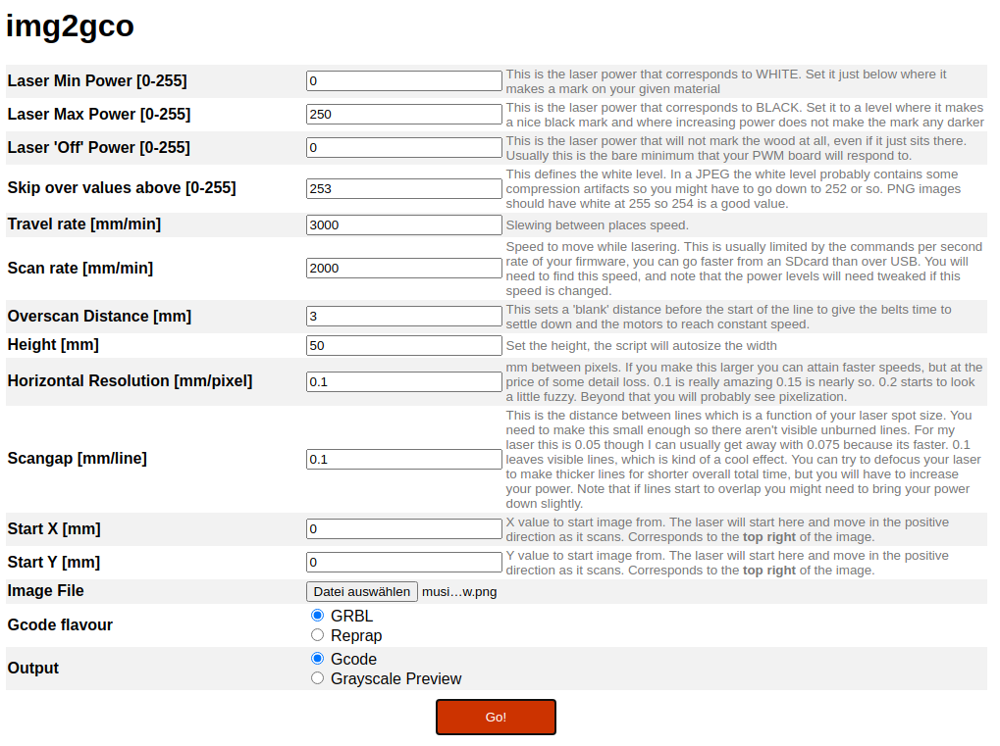

# img2gco
Image to grbl/reprap compliant gcode converter

See http://wiki.nebarnix.com/wiki/Img2gco for overall project details!

Todo:
- [ ] Generated bounding box code at start of print
- [ ] Change to relative coordinates for ease of fine positioning
- [ ] Add feedrate dependent engraving in combination with laser intensity for darker blacks and whiter whites on certain materials like wood
- [ ] Add customized start and end gCodes
- [ ] Add areas that are above the white clip boundary to preview where skip-overs will be
- [ ] Define width and height of resulting engraving separately
- [ ] Define origin of coordinate system for easier adaptation to different laser engravers
